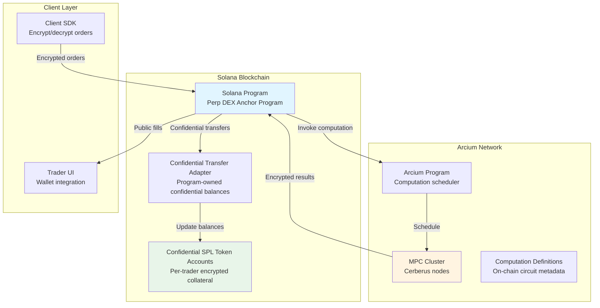
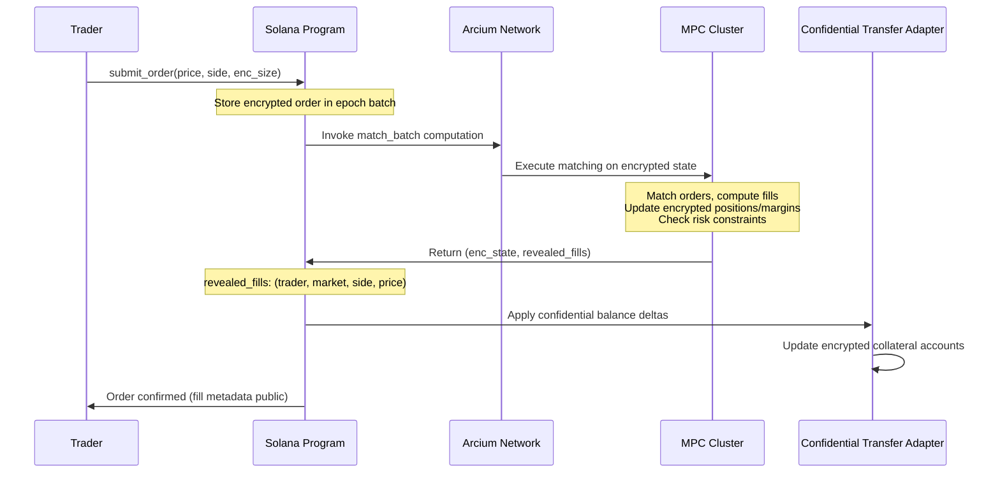

# Private Perp DEX on Solana with Arcium - Architecture Document

## Executive Summary

This document specifies the architecture for a **private perpetual futures DEX** on Solana using **Arcium MPC** for encrypted matching/risk computation and **Confidential SPL Token** for encrypted balance management. The design enables traders to hide order sizes, positions, and margins while keeping trader identities and prices public, enabling private orderflow protection without sacrificing on-chain composability.

**Key Innovation:** Unlike ZK-based designs that prove correctness publicly, this architecture uses MPC to compute matching and risk checks on encrypted data, with results committed on-chain via Confidential SPL Token transfers.

---

## System Architecture Overview

### High-Level Component Diagram



### Data Flow: Order Submission → Matching → Settlement



---

## Core Components

### 1. Solana Program (Anchor)

**Program ID:** `PerpDexProgram`

#### Account Structures

**`MarketState`** (PDA: `[b"market", market_id]`)
```rust
pub struct MarketState {
    // Public market configuration
    pub market_id: u16,
    pub base_asset_mint: Pubkey,           // e.g., BTC
    pub quote_asset_mint: Pubkey,          // e.g., USDC (Confidential SPL)
    pub tick_size: u64,                    // Minimum price increment
    pub min_order_size: u64,               // Minimum order size (public)
    pub max_order_size: u64,               // Maximum order size (public)
    pub maker_fee_bps: u16,                // Maker fee in basis points
    pub taker_fee_bps: u16,                // Taker fee in basis points
    
    // Encrypted engine state (Enc<Mxe, EngineState> serialized as Vec<u8>)
    pub engine_state_ciphertext: Vec<u8>,  // ~32KB max (Solana account limit)
    
    // Public market metadata
    pub mark_price: u64,                   // Current mark price (from oracle)
    pub index_price: u64,                   // Index price (from oracle)
    pub funding_rate: i64,                 // Current funding rate (public)
    pub last_funding_update_slot: u64,
    
    // Epoch management
    pub current_epoch_id: u64,
    pub epoch_start_slot: u64,
    pub epoch_duration_slots: u64,         // e.g., 150 slots (~1.5 seconds)
    
    pub bump: u8,
}
```

**`TraderState`** (PDA: `[b"trader", trader_pubkey]`)
```rust
pub struct TraderState {
    pub trader: Pubkey,
    
    // Encrypted risk state (Enc<Mxe, TraderRiskState>)
    pub risk_state_ciphertext: Vec<u8>,    // Encrypted positions, margins
    
    // Public metadata (can be inferred but stored for efficiency)
    pub margin_mode: MarginMode,           // Isolated or Cross (public)
    pub has_open_positions: bool,          // Quick check flag
    pub last_update_slot: u64,
    
    // Confidential SPL Token account addresses (public addresses, encrypted balances)
    pub collateral_account: Pubkey,       // Confidential SPL token account
    pub isolated_margin_accounts: Vec<Pubkey>, // Per-market isolated margin (if applicable)
    
    pub bump: u8,
}
```

**`EpochState`** (PDA: `[b"epoch", market_id, epoch_id]`)
```rust
pub struct EpochState {
    pub market_id: u16,
    pub epoch_id: u64,
    pub start_slot: u64,
    pub end_slot: u64,
    
    // Encrypted order batch (Enc<Mxe, OrderBatch>)
    pub order_batch_ciphertext: Vec<u8>,
    
    // Public price ticks observed in this epoch
    pub price_ticks: Vec<u64>,              // Sorted list of prices with orders
    
    // Settlement status
    pub is_settled: bool,
    pub settlement_slot: Option<u64>,
    
    pub bump: u8,
}
```

**`FillEvent`** (Event account, created per fill)
```rust
pub struct FillEvent {
    pub market_id: u16,
    pub epoch_id: u64,
    pub taker: Pubkey,                     // Public
    pub maker: Pubkey,                     // Public
    pub side: OrderSide,                   // Public (Buy/Sell)
    pub price: u64,                        // Public
    // Size is NOT stored (private)
    pub slot: u64,
}
```

#### Key Instructions

**`deposit_collateral`**
- **Inputs:** `amount: u64` (public), `trader: Signer`
- **Flow:**
  1. Transfer `amount` from trader's public SPL token account → program vault
  2. Wrap to Confidential SPL Token via Confidential Transfer Adapter
  3. Credit encrypted balance to trader's Confidential SPL account
  4. Update `TraderState.risk_state_ciphertext` via MPC (increment collateral)

**`submit_order`**
- **Inputs:** `market_id: u16`, `price: u64` (public), `side: OrderSide` (public), `enc_size: Enc<Shared, u64>`, `order_type: OrderType`, `time_in_force: TimeInForce`
- **Flow:**
  1. Validate public inputs (price within bounds, market active)
  2. Load current `EpochState` for market
  3. Encrypt order with MXE public key: `order_ctxt = Enc<Shared, Order>`
  4. Append to `EpochState.order_batch_ciphertext`
  5. Add `price` to `price_ticks` if not present
  6. Return order confirmation (order_id derived from slot + trader)

**`settle_epoch`** (Called by sequencer/keeper)
- **Inputs:** `market_id: u16`, `epoch_id: u64`
- **Flow:**
  1. Load `EpochState` and `MarketState.engine_state_ciphertext`
  2. Invoke Arcium computation: `match_batch(epoch_orders, engine_state)`
  3. Receive: `(new_engine_state_ctxt, revealed_fills)`
  4. For each fill in `revealed_fills`:
     - Create `FillEvent` account (public metadata)
     - Compute confidential balance deltas via MPC
     - Apply Confidential SPL transfers via Confidential Transfer Adapter
  5. Update `MarketState.engine_state_ciphertext` with new state
  6. Mark `EpochState.is_settled = true`

**`withdraw_collateral`**
- **Inputs:** `amount: u64` (public, or "max"), `trader: Signer`
- **Flow:**
  1. Invoke MPC: `compute_withdrawal(trader_state_ctxt, requested_amount)`
  2. MPC returns: `(new_trader_state_ctxt, revealed_amount, is_valid)`
  3. If valid:
     - Update `TraderState.risk_state_ciphertext`
     - Transfer `revealed_amount` from Confidential SPL → Public SPL via adapter
     - Unwrap and send to trader

---

### 2. MPC Confidential Instructions (Arcis)

**Location:** `encrypted-ixs/` directory in Arcium project

#### Instruction: `match_batch`

**Purpose:** Match all orders in an epoch, update encrypted positions/margins, enforce risk constraints.

**Signature:**
```rust
#[instruction]
pub fn match_batch(
    epoch_orders: Enc<Mxe, OrderBatch>,
    engine_state: Enc<Mxe, EngineState>,
    public_prices: Vec<u64>,  // Plaintext: sorted price ticks in epoch
    mark_price: u64,          // Plaintext: current mark price
) -> (
    Enc<Mxe, EngineState>,    // Updated encrypted state
    RevealedFills,            // Public fill metadata
)
```

**Input Types:**
```rust
struct OrderBatch {
    orders: Vec<EncryptedOrder>,
}

struct EncryptedOrder {
    trader_pubkey: Pubkey,        // Public (revealed)
    price: u64,                    // Public (revealed)
    side: OrderSide,               // Public (revealed)
    size: Enc<Mxe, u64>,           // Private
    order_type: OrderType,         // Public
    time_in_force: TimeInForce,    // Public
    submission_slot: u64,          // Public (for FIFO)
}

struct EngineState {
    trader_states: HashMap<Pubkey, Enc<Mxe, TraderRiskState>>,
    orderbook: Enc<Mxe, OrderBookState>,
    open_interest: Enc<Mxe, u128>,
    funding_rate_accumulator: Enc<Mxe, i64>,
    last_funding_update_slot: u64,
}
```

**Output Types:**
```rust
struct RevealedFills {
    fills: Vec<FillMetadata>,
}

struct FillMetadata {
    taker: Pubkey,     // Public
    maker: Pubkey,     // Public
    market_id: u16,    // Public
    side: OrderSide,   // Public
    price: u64,        // Public
    // size is NOT revealed
}
```

**Algorithm (pseudocode in MPC):**
```rust
fn match_batch(...) {
    let mut state = engine_state.to_arcis();
    let orders = epoch_orders.to_arcis();
    let mut fills = Vec::new();
    
    // Group orders by price (public), then sort by submission_slot (FIFO)
    let price_levels = group_by_price(orders);
    
    for price_level in price_levels.sorted_by_price() {
        let price = price_level.price; // Public
        let mut asks = price_level.asks; // Encrypted sizes
        let mut bids = price_level.bids; // Encrypted sizes
        
        // Match asks vs bids at this price
        while !asks.is_empty() && !bids.is_empty() {
            let ask = asks[0].to_arcis();
            let bid = bids[0].to_arcis();
            
            // Compute fill size (min of ask.size and bid.size)
            let fill_size = min(ask.size, bid.size);
            
            // Update order sizes
            ask.size = ask.size - fill_size;
            bid.size = bid.size - fill_size;
            
            // Remove filled orders
            if ask.size == 0 { asks.remove(0); }
            if bid.size == 0 { bids.remove(0); }
            
            // Update encrypted positions/margins
            let taker_state = state.trader_states[ask.trader].to_arcis();
            let maker_state = state.trader_states[bid.trader].to_arcis();
            
            // Apply trade (compute PnL, update collateral, check margin)
            let (new_taker_state, new_maker_state) = apply_trade(
                taker_state, maker_state, fill_size, price, mark_price
            );
            
            // Risk checks (all in MPC)
            assert!(has_sufficient_margin(new_taker_state));
            assert!(has_sufficient_margin(new_maker_state));
            
            state.trader_states[ask.trader] = new_taker_state.from_arcis();
            state.trader_states[bid.trader] = new_maker_state.from_arcis();
            
            // Record fill (public metadata only)
            fills.push(FillMetadata {
                taker: ask.trader,
                maker: bid.trader,
                market_id,
                side: OrderSide::Sell, // ask side
                price,
            });
        }
    }
    
    // Update open interest (encrypted)
    state.open_interest = compute_new_open_interest(state);
    
    (state.from_arcis(), RevealedFills { fills })
}
```

#### Instruction: `apply_funding`

**Purpose:** Compute and apply funding rate payments to all open positions.

**Signature:**
```rust
#[instruction]
pub fn apply_funding(
    engine_state: Enc<Mxe, EngineState>,
    mark_price: u64,
    index_price: u64,
    time_elapsed_slots: u64,
) -> Enc<Mxe, EngineState>
```

**Algorithm:**
```rust
fn apply_funding(...) {
    let mut state = engine_state.to_arcis();
    
    // Compute funding rate: (mark_price - index_price) / index_price * funding_rate_multiplier
    let funding_rate = compute_funding_rate(mark_price, index_price);
    
    // Apply to each trader's position
    for (trader, trader_state) in state.trader_states.iter_mut() {
        let position = trader_state.positions[market_id].to_arcis();
        let funding_payment = position.size * funding_rate * time_elapsed_slots;
        
        // Update collateral (encrypted)
        trader_state.collateral = trader_state.collateral - funding_payment;
        
        // Update funding accumulator
        trader_state.last_funding_rate_prefix_sum += funding_rate;
    }
    
    state.from_arcis()
}
```

#### Instruction: `check_liquidation`

**Purpose:** Check if a trader's position is liquidatable based on margin requirements.

**Signature:**
```rust
#[instruction]
pub fn check_liquidation(
    trader_state: Enc<Mxe, TraderRiskState>,
    mark_price: u64,
    maintenance_margin_fraction: u16,
) -> (
    bool,                              // Is liquidatable (revealed)
    Enc<Mxe, TraderRiskState>,        // Updated state (if liquidated)
    Option<LiquidationResult>,        // Revealed liquidation details (if applicable)
)
```

**Algorithm:**
```rust
fn check_liquidation(...) {
    let state = trader_state.to_arcis();
    
    // Compute total account value
    let collateral = state.collateral;
    let unrealized_pnl = compute_unrealized_pnl(state.positions, mark_price);
    let total_value = collateral + unrealized_pnl;
    
    // Compute margin requirement
    let position_notional = abs(state.position.size) * mark_price;
    let margin_requirement = position_notional * maintenance_margin_fraction;
    
    // Check if liquidatable
    let is_liquidatable = total_value < margin_requirement;
    
    if is_liquidatable {
        // Close position, return remaining collateral
        let new_state = close_position(state);
        (true, new_state.from_arcis(), Some(LiquidationResult { ... }))
    } else {
        (false, trader_state, None)
    }
}
```

#### Instruction: `compute_risk`

**Purpose:** Validate that a new position delta would not violate margin requirements.

**Signature:**
```rust
#[instruction]
pub fn compute_risk(
    trader_state: Enc<Mxe, TraderRiskState>,
    new_position_delta: Enc<Shared, PositionDelta>,
    mark_price: u64,
    initial_margin_fraction: u16,
) -> RiskCheckResult
```

**Returns:**
```rust
struct RiskCheckResult {
    is_valid: bool,                    // Revealed
    new_collateral_requirement: u64,   // Revealed (for UI display, not exact)
    margin_utilization: u8,            // Revealed (0-100, approximate)
}
```

---

### 3. Confidential SPL Token Integration

#### Architecture

The DEX uses **Confidential SPL Token** (via Confidential Transfer Adapter) for all collateral management:

1. **Base Collateral:** USDC wrapped as Confidential SPL Token
   - Each trader has a Confidential SPL account owned by the program PDA
   - Balances are encrypted (`Enc<Mxe, u64>`)
   - Transfers happen via Confidential Transfer Adapter CPI calls

2. **Isolated Margin (optional):**
   - Per-market Confidential SPL accounts for isolated positions
   - Margin is locked per position, not shared across markets

#### Integration Pattern

**Deposit Flow:**
```rust
// In Solana program instruction
pub fn deposit_collateral(ctx: Context<DepositCollateral>, amount: u64) -> Result<()> {
    // 1. Transfer public SPL token to program vault
    anchor_spl::token::transfer(
        CpiContext::new(&ctx.accounts.token_program, &transfer_ctx),
        amount,
    )?;
    
    // 2. Wrap to Confidential SPL via Confidential Transfer Adapter
    let wrap_ix = ConfidentialTransferAdapter::wrap(
        &ctx.accounts.vault_account,
        &ctx.accounts.trader_confidential_account,
        amount,
    )?;
    invoke(&wrap_ix, &ctx.accounts)?;
    
    // 3. Update encrypted trader state via MPC
    let update_ix = invoke_computation(
        "update_collateral",
        EncryptedInput {
            trader: ctx.accounts.trader.key(),
            delta: Enc::new_shared(amount), // Encrypted
        },
    )?;
    invoke(&update_ix, &ctx.accounts)?;
    
    Ok(())
}
```

**Settlement Flow (after MPC matching):**
```rust
// After match_batch returns fills
for fill in revealed_fills {
    // Compute balance deltas in MPC (already done in match_batch)
    // Apply Confidential SPL transfers
    ConfidentialTransferAdapter::transfer(
        &ctx.accounts.trader_a_confidential_account,
        &ctx.accounts.trader_b_confidential_account,
        &encrypted_delta, // Enc<Mxe, u64> from MPC
    )?;
}
```

#### Benefits of Confidential SPL Token

- **Programmatic control:** Program PDA can move encrypted balances (fixes Token-2022 limitation)
- **Standard interface:** Compatible with existing SPL token infrastructure
- **Auditability:** Optional auditor keys for compliance
- **Composability:** Can unwrap Confidential SPL → Public SPL for DeFi integration

---

### 4. Batch Auction Matching Algorithm

#### Epoch Structure

- **Epoch Duration:** Configurable per market (default: 150 Solana slots ≈ 1.5 seconds)
- **Epoch Boundary:** Fixed slot intervals (e.g., epoch N starts at slot `N * 150`)
- **Order Collection:** Orders submitted during epoch N are included in epoch N's batch

#### Matching Rules

**Price-Time Priority (Default):**
1. Orders grouped by price (public)
2. Within each price level, sorted by `submission_slot` (FIFO)
3. Match best bid vs best ask iteratively
4. Partial fills supported (order size reduced, not removed)

**Pro-Rata Option (Alternative):**
- At same price level, distribute fills proportionally to order sizes
- Reduces value of queue-jumping
- Requires revealing aggregate size at price level (but not individual sizes)

#### Implementation in MPC

```rust
// Pseudocode for price-time priority matching
fn match_price_time_priority(orders: Vec<EncryptedOrder>) {
    // Group by price (public)
    let mut price_levels: HashMap<u64, Vec<EncryptedOrder>> = HashMap::new();
    for order in orders {
        price_levels[order.price].push(order);
    }
    
    // Sort price levels (best bid = highest, best ask = lowest)
    let sorted_prices = price_levels.keys().sorted();
    
    for price in sorted_prices {
        let mut asks = price_levels[price].filter(|o| o.side == Ask);
        let mut bids = price_levels[price].filter(|o| o.side == Bid);
        
        // Sort by submission_slot (FIFO)
        asks.sort_by(|a, b| a.submission_slot.cmp(&b.submission_slot));
        bids.sort_by(|a, b| a.submission_slot.cmp(&b.submission_slot));
        
        // Match iteratively
        while !asks.is_empty() && !bids.is_empty() {
            let fill_size = min(asks[0].size, bids[0].size); // Encrypted comparison
            // ... apply fill, update orders ...
        }
    }
}
```

---

## Trust Boundaries & Security Model

### What is Trusted

1. **Arcium MPC Cluster:** Honest-majority assumption (e.g., 3-of-5 nodes)
   - If majority is honest, encrypted data remains private
   - Matching logic executes correctly

2. **Confidential Transfer Adapter:** Correctly implements Confidential SPL Token semantics
   - Transfers are atomic and preserve encryption

3. **Solana Validators:** Standard Solana security assumptions
   - Transaction ordering, account state consistency

### What is NOT Trusted

1. **Sequencer/Keeper:** Can choose epoch boundaries and trigger settlement, but cannot:
   - See order sizes (encrypted)
   - Manipulate matching results (MPC enforces correctness)
   - Skip valid orders (epoch boundaries are deterministic)

2. **Individual MPC Nodes:** Single node compromise doesn't leak data (honest-majority)

3. **Public Observers:** Cannot infer:
   - Individual order sizes
   - Position sizes
   - Margin amounts
   - Aggregate orderbook depth

### Attack Vectors & Mitigations

**Front-running:** 
- **Risk:** Public prices enable copying orders
- **Mitigation:** Batch auctions reduce value of front-running; pro-rata matching further reduces it

**Order Size Inference:**
- **Risk:** Observing fill patterns might reveal sizes
- **Mitigation:** Multiple fills per epoch, partial fills obscure exact sizes

**MPC Node Collusion:**
- **Risk:** Majority of MPC nodes collude to leak data
- **Mitigation:** Use reputable MPC cluster operators, consider multi-cluster redundancy

**Epoch Manipulation:**
- **Risk:** Sequencer delays settlement to see more orders
- **Mitigation:** Fixed epoch boundaries, multiple keepers can trigger settlement

---

## Performance Characteristics

### Latency

- **Order Submission:** < 400ms (Solana confirmation)
- **Epoch Matching:** 1-2 seconds (MPC computation time)
- **Settlement:** < 400ms (on-chain state update)
- **Total:** ~2-3 seconds from order submission to fill confirmation

### Throughput

- **Orders per Epoch:** 1000+ (limited by MPC circuit size)
- **Fills per Epoch:** 500+ (depends on order matching)
- **Markets:** Unlimited (each market has independent state)

### Storage

- **MarketState:** ~10KB per market (mostly ciphertext)
- **TraderState:** ~5KB per trader (encrypted risk state)
- **EpochState:** ~50KB per epoch (encrypted order batch)
- **FillEvent:** ~100 bytes per fill (public metadata only)

---

## Comparison with ZK-Based Design

| Aspect | ZK Design (lighter-prover) | MPC Design (This) |
|--------|---------------------------|-------------------|
| **Privacy Model** | Witness-private (prover sees all) | Data-private (MPC nodes see encrypted) |
| **Verifiability** | Public (anyone can verify proof) | Trust MPC cluster (honest-majority) |
| **Matching Logic** | Proved in-circuit | Executed in MPC |
| **Settlement** | On-chain via proof verification | On-chain via MPC result + Confidential SPL |
| **Latency** | Proof generation (seconds-minutes) | MPC computation (1-2 seconds) |
| **Complexity** | Complex circuit constraints | Simpler MPC instructions |
| **Composability** | Requires proof verification | Standard Confidential SPL integration |

**Trade-off:** MPC design trades public verifiability for better privacy guarantees (data never decrypted) and simpler development (no proof generation).

---

## Next Steps

1. **Phase 1:** Implement core Solana program structure and Confidential SPL Token integration
2. **Phase 2:** Build MPC matching engine (`match_batch` instruction)
3. **Phase 3:** Add risk management (funding, liquidation checks)
4. **Phase 4:** Deploy to Arcium testnet, integrate with Confidential SPL Token testnet

---

**Document Version:** 1.0  
**Last Updated:** 2025-01-26  
**Author:** Architecture analysis based on lighter-prover + Arcium Confidential SPL Token

