# Private Perp DEX on Solana with Arcium - Product Specification

## Document Overview

**Product Name:** Private Perp DEX (Powered by Arcium)  
**Version:** 1.0  
**Last Updated:** 2025-01-26  
**Target Users:** Traders seeking private orderflow, institutions requiring position privacy

---

## Product Vision

Enable **private perpetual futures trading** on Solana where:
- ✅ **Trader identities are public** (enables on-chain settlement via Confidential SPL Token)
- ✅ **Order prices and sides are public** (enables transparent price discovery)
- 🔒 **Order sizes are private** (prevents front-running and orderflow exploitation)
- 🔒 **Position sizes and margins are private** (protects trading strategies)
- 🔒 **PnL and account balances are private** (institutional privacy)

**Value Proposition:** The first composable private perp DEX on Solana that protects orderflow without sacrificing on-chain interoperability.

---

## Privacy Guarantees

### What is Public (On-Chain Visible)

1. **Trader Identity**
   - Solana wallet pubkey (`Pubkey`)
   - Required for on-chain settlement and Confidential SPL Token account management

2. **Order Metadata**
   - Price (u64)
   - Side (Buy/Sell)
   - Market ID (u16)
   - Order type (Limit/Market/IOC/Post-Only)
   - Time in force (GTT/IOC/Post-Only)
   - Submission slot (for FIFO ordering)

3. **Fill Events**
   - Taker pubkey
   - Maker pubkey
   - Market ID
   - Side
   - Price
   - Epoch ID
   - Slot timestamp

4. **Market State**
   - Mark price (from oracle)
   - Index price (from oracle)
   - Funding rate (public)
   - Market status (Active/Paused/Expired)

5. **Account Metadata**
   - Margin mode (Isolated/Cross) - public setting
   - Whether account has open positions (boolean flag)
   - Last update slot

### What is Private (Encrypted, Only MPC Can Decrypt)

1. **Order Sizes**
   - Individual order size (`Enc<Mxe, u64>`)
   - Cannot be inferred from fill events (multiple fills per order possible)

2. **Position Data**
   - Position size (`Enc<Mxe, i64>`) - signed (long/short)
   - Entry price (can be computed from PnL, but stored encrypted)
   - Unrealized PnL (`Enc<Mxe, i64>`)

3. **Margin & Collateral**
   - Collateral balance (`Enc<Mxe, u128>`)
   - Allocated margin per position (`Enc<Mxe, u128>`)
   - Available margin (`Enc<Mxe, u128>`)
   - Margin utilization percentage

4. **Risk Metrics**
   - Total account value (`Enc<Mxe, i128>`)
   - Initial/maintenance margin requirements (computed in MPC, not stored)
   - Health status (Healthy/Pre-Liquidation/Liquidatable) - can be revealed selectively

5. **Orderbook Depth**
   - Aggregate size at each price level (`Enc<Mxe, u64>`)
   - Total open interest (`Enc<Mxe, u128>`)

### What Cannot Be Inferred

Even with public data, observers **cannot** determine:
- **Exact order sizes:** Multiple orders at same price, partial fills obscure individual sizes
- **Position sizes:** Only fill direction (buy/sell) visible, not net position
- **Account balances:** No on-chain balance queries possible
- **Margin utilization:** Cannot compute risk ratios without encrypted state
- **Trading strategies:** Position sizes and entry prices hidden

### Privacy Leakage Scenarios & Mitigations

**Scenario 1: Size Inference from Fill Patterns**
- **Risk:** If trader always fills completely, size might be inferred
- **Mitigation:** Support partial fills, multiple orders per price level

**Scenario 2: Position Inference from Trade Direction**
- **Risk:** Observing only buys might indicate building long position
- **Mitigation:** True, but exact size remains unknown; can mix with sells

**Scenario 3: Balance Inference from Withdrawals**
- **Risk:** Withdrawal amount reveals minimum balance
- **Mitigation:** Support "withdraw max" to avoid revealing exact balance

---

## Risk Model (All Enforced in MPC)

### Margin Requirements

**Initial Margin Fraction:**
- Default: Configurable per market (e.g., 5% = 50,000 ticks, where 1 tick = 0.1%)
- Minimum: Market-specific minimum (e.g., 2% = 20,000 ticks)
- Per-position: Can be set higher for specific positions (isolated mode)

**Maintenance Margin Fraction:**
- Typically 50% of initial margin (e.g., 2.5% = 25,000 ticks)
- Used for liquidation threshold

**Close-Out Margin Fraction:**
- Typically 75% of initial margin (e.g., 3.75% = 37,500 ticks)
- Used for pre-liquidation warnings

**Margin Computation (in MPC):**
```rust
// Pseudocode
fn compute_margin_requirement(
    position_size: Enc<Mxe, i64>,
    mark_price: u64,
    initial_margin_fraction: u16,
) -> Enc<Mxe, u128> {
    let position_notional = abs(position_size) * mark_price;
    let margin_requirement = position_notional * initial_margin_fraction / 10000;
    margin_requirement
}
```

### Liquidation Logic

**Liquidation Trigger:**
- Account health drops below maintenance margin requirement
- Health = (Collateral + Unrealized PnL) / Margin Requirement

**Liquidation Process (in MPC):**
1. Check if `total_account_value < maintenance_margin_requirement`
2. If liquidatable:
   - Close position at mark price (or better if possible)
   - Apply liquidation fee (e.g., 2% of position notional)
   - Return remaining collateral to trader
   - Update encrypted state

**Liquidation Fee:**
- Configurable per market (e.g., 2% = 20,000 basis points)
- Paid from trader's collateral
- Transferred to insurance fund (Confidential SPL account)

### Funding Rate Computation

**Funding Rate Formula:**
```
funding_rate = (mark_price - index_price) / index_price * funding_rate_multiplier
```

**Funding Payment:**
```
payment_per_period = position_size * funding_rate * time_elapsed
```

**Funding Period:** 1 hour (configurable)

**Funding Rate Clamps:**
- Small clamp: ±0.05% per period (500 ticks)
- Big clamp: ±4% per period (40,000 ticks)
- Prevents extreme funding rates

**Implementation (in MPC):**
```rust
fn apply_funding_payment(
    position: Enc<Mxe, Position>,
    mark_price: u64,
    index_price: u64,
    time_elapsed_slots: u64,
    funding_rate_multiplier: u32,
) -> Enc<Mxe, i64> {
    let price_diff = mark_price - index_price;
    let funding_rate = (price_diff * funding_rate_multiplier) / index_price;
    
    // Clamp funding rate
    let funding_rate = clamp(funding_rate, -FUNDING_BIG_CLAMP, FUNDING_BIG_CLAMP);
    
    // Compute payment
    let position_notional = abs(position.size) * mark_price;
    let payment = position_notional * funding_rate * time_elapsed_slots / FUNDING_PERIOD;
    
    // Long positions pay shorts when funding_rate > 0
    let payment_signed = if position.size > 0 {
        -payment  // Long pays
    } else {
        payment   // Short receives
    };
    
    payment_signed
}
```

### Margin Modes

**Cross Margin:**
- Single collateral pool shared across all positions
- Margin can be reallocated between positions
- More capital efficient
- Risk: One position can liquidate entire account

**Isolated Margin:**
- Separate margin allocated per position
- Position liquidation doesn't affect other positions
- Less capital efficient
- Safer for multi-position strategies

**Margin Mode Selection:**
- Set per account (public setting)
- Can switch modes (requires closing positions or adding margin)

---

## User Flows

### Flow 1: Deposit Collateral → Place Order → Receive Fill → Withdraw

```mermaid
sequenceDiagram
    participant U as User
    participant W as Wallet
    participant SP as Solana Program
    participant MPC as Arcium MPC
    participant CTA as Confidential Transfer Adapter
    
    Note over U,CTA: Step 1: Deposit
    U->>W: deposit_collateral(1000 USDC)
    W->>SP: Transfer public USDC to vault
    SP->>CTA: Wrap to Confidential SPL
    CTA->>CTA: Create encrypted balance
    SP->>MPC: update_collateral(trader, +1000)
    MPC->>SP: Updated encrypted state
    SP->>U: Deposit confirmed
    
    Note over U,CTA: Step 2: Place Order
    U->>W: submit_order(market=BTC, price=50000, side=Buy, size=0.1 BTC)
    W->>W: Encrypt size with MXE key
    W->>SP: submit_order(price, side, enc_size)
    SP->>SP: Add to current epoch batch
    SP->>U: Order submitted (order_id)
    
    Note over U,CTA: Step 3: Epoch Settlement
    SP->>MPC: match_batch(epoch_orders, engine_state)
    MPC->>MPC: Match orders, compute fills
    MPC->>MPC: Update encrypted positions/margins
    MPC->>SP: (new_state, revealed_fills)
    SP->>CTA: Apply confidential balance transfers
    SP->>U: Fill event: (trader, market, side, price)
    
    Note over U,CTA: Step 4: Withdraw
    U->>W: withdraw_collateral("max")
    W->>SP: withdraw_collateral request
    SP->>MPC: compute_withdrawal(trader_state, "max")
    MPC->>MPC: Decrypt balance, compute withdrawal
    MPC->>SP: (revealed_amount, new_state)
    SP->>CTA: Transfer Confidential SPL → Public SPL
    CTA->>W: Unwrap and send USDC
    W->>U: Withdrawal complete
```



### Flow 2: Open Position → Monitor Margin → Add Margin (if needed)

1. **User places order** → Order matches → Position opened (encrypted size)
2. **User queries position** → Client decrypts `TraderState.risk_state_ciphertext` → Shows encrypted position size, PnL
3. **Margin warning** → MPC reveals `health_status = PreLiquidation` → User adds margin
4. **Add margin** → `deposit_collateral` → MPC updates encrypted collateral

### Flow 3: Stop-Loss Order Execution

1. **User places stop-loss** → Order stored in encrypted state with trigger price
2. **Mark price crosses trigger** → MPC checks trigger conditions during `match_batch`
3. **Stop-loss triggers** → Converted to market order → Executed immediately
4. **Position closed** → Encrypted position size set to zero → Remaining margin returned

---

## Product Features

### Core Trading Features

#### 1. Order Types

**Limit Orders**
- **GTT (Good Till Time):** Active until expiry slot
- **IOC (Immediate Or Cancel):** Fill immediately or cancel
- **Post-Only:** Only maker, reject if would take liquidity

**Market Orders**
- Always IOC
- Execute at best available price
- Slippage protection via max price deviation

**Stop-Loss Orders**
- Trigger when mark price crosses trigger price
- Convert to market order on trigger
- Private: Trigger price and order size encrypted

**Take-Profit Orders**
- Trigger when mark price reaches target
- Convert to limit order on trigger
- Private: Target price and size encrypted

#### 2. Position Management

**Open Position**
- Long: Buy perpetual contract
- Short: Sell perpetual contract
- Position size encrypted, only trader can decrypt

**Close Position**
- Place opposite order (reduce-only)
- Or: Market order with reduce-only flag
- MPC enforces: cannot increase position size

**Partial Close**
- Modify order size to close portion
- Remaining position size updated in encrypted state

#### 3. Margin Management

**Deposit Margin**
- Transfer public SPL → Confidential SPL
- Margin added to encrypted collateral
- Available for new positions or margin calls

**Withdraw Margin**
- Request withdrawal amount (or "max")
- MPC checks: sufficient margin after withdrawal
- Transfer Confidential SPL → Public SPL

**Margin Mode Switch**
- Cross ↔ Isolated
- Requires: sufficient margin in target mode
- All positions must be compatible with new mode

### Advanced Features

#### 4. Funding Rate Payments

**Automatic Application**
- Computed every hour (or configurable period)
- Applied to all open positions
- Deducted from encrypted collateral
- Long pays short when funding_rate > 0

**Funding Rate Display**
- Public: Current funding rate (on-chain)
- Private: Individual funding payments (encrypted)

#### 5. Liquidation Protection

**Pre-Liquidation Warning**
- Health drops below close-out margin
- User notified (can add margin)
- Position still tradeable

**Liquidation**
- Triggered when health < maintenance margin
- Position closed automatically
- Liquidation fee applied
- Remaining collateral returned

**Liquidation Price Display**
- MPC can reveal approximate liquidation price
- Based on current collateral and position size
- Updated in real-time as prices move

#### 6. Order Modifications

**Modify Order**
- Change price, size, or trigger price
- Original order cancelled, new order created
- Maintains queue position (if price unchanged)

**Cancel Order**
- Remove order from orderbook
- Encrypted size never revealed
- Immediate cancellation

**Cancel All Orders**
- Cancel all orders for trader
- Per-market or all markets
- Useful for risk management

### User Interface Features

#### 7. Account Dashboard

**Public Information:**
- Trader pubkey
- Margin mode (Cross/Isolated)
- Markets traded
- Fill history (price, side, market)

**Private Information (Requires Decryption Key):**
- Collateral balance
- Position sizes per market
- Unrealized PnL
- Margin utilization
- Available margin

**Decryption Flow:**
1. Client fetches `TraderState.risk_state_ciphertext` from chain
2. Client uses MXE decryption key (from Arcium client SDK)
3. Decrypts `TraderRiskState`
4. Displays private information to user

#### 8. Orderbook View

**Public Information:**
- Price levels (sorted)
- Side (Bid/Ask)
- Number of orders at each price (if revealed)

**Private Information:**
- Aggregate size at each price (`Enc<Mxe, u64>`)
- Individual order sizes
- Orderbook depth

**Display Options:**
- **Sparse:** Show only price levels with orders (no sizes)
- **Aggregate (Optional):** Reveal aggregate size per price level (less private, more informative)

#### 9. Trade History

**Public Events:**
- Fill events: `(trader, market, side, price, slot)`
- Deposit/withdrawal events: `(trader, amount, slot)` (if revealed)
- Liquidation events: `(trader, market, slot)`

**Private Details:**
- Fill sizes (never revealed)
- Position sizes before/after fill
- PnL per trade

---

## Technical Requirements

### Performance Targets

**Latency:**
- Order submission: < 400ms (Solana confirmation)
- Epoch matching: 1-2 seconds (MPC computation)
- Settlement: < 400ms (on-chain update)
- **Total order-to-fill:** < 3 seconds

**Throughput:**
- Orders per epoch: 1000+
- Fills per epoch: 500+
- Markets: Unlimited (independent state per market)
- Traders: Unlimited (per-trader state accounts)

**Scalability:**
- Support 100+ concurrent markets
- 10,000+ active traders
- 10,000+ orders per day per market

### Security Requirements

**MPC Security:**
- Honest-majority assumption (e.g., 3-of-5 nodes)
- No single point of failure
- Encrypted data never decrypted outside MPC

**On-Chain Security:**
- Solana program upgrade authority (multisig)
- Epoch boundaries enforced deterministically
- Confidential SPL Token auditability (optional auditor keys)

**Privacy Security:**
- Order sizes never revealed (even in fill events)
- Position sizes never revealed (except to trader via decryption)
- Margin amounts never revealed (except on withdrawal)

### Composability Requirements

**SPL Token Compatibility:**
- Deposit/withdraw standard SPL tokens (USDC, etc.)
- Wrap to Confidential SPL automatically
- Unwrap for DeFi integration

**Program Composability:**
- Other Solana programs can call perp DEX instructions
- Standard Anchor account constraints
- CPI (Cross-Program Invocation) support

**Oracle Integration:**
- Accept mark/index prices from standard Solana oracles
- Pyth Network integration
- Switchboard integration

---

## Acceptance Criteria

### Feature: Private Order Submission

**Given:** User has deposited collateral  
**When:** User submits order with encrypted size  
**Then:**
- ✅ Order stored in encrypted epoch batch
- ✅ Public metadata (price, side) visible on-chain
- ✅ Order size remains encrypted
- ✅ Order receives confirmation with order_id

### Feature: Batch Matching

**Given:** Epoch contains multiple orders  
**When:** Epoch settlement triggered  
**Then:**
- ✅ Orders matched at public prices
- ✅ Fills computed in MPC (sizes private)
- ✅ Encrypted positions/margins updated
- ✅ Public fill events created (trader, market, side, price)
- ✅ Confidential SPL balances updated

### Feature: Position Privacy

**Given:** Trader has open position  
**When:** Observer queries on-chain state  
**Then:**
- ✅ Cannot determine position size
- ✅ Cannot determine entry price
- ✅ Cannot determine PnL
- ✅ Can only see fill direction (buy/sell) from fill events

### Feature: Margin Management

**Given:** Trader has open position  
**When:** Trader adds/removes margin  
**Then:**
- ✅ Margin changes applied to encrypted collateral
- ✅ MPC validates sufficient margin after change
- ✅ Confidential SPL balance updated
- ✅ Margin amount remains private (except on withdrawal)

### Feature: Liquidation

**Given:** Trader position health < maintenance margin  
**When:** Liquidation check runs  
**Then:**
- ✅ Position closed automatically
- ✅ Liquidation fee applied
- ✅ Remaining collateral returned
- ✅ Liquidation event created (public)
- ✅ Position size never revealed

---

## Deployment Plan

### Phase 1: Infrastructure Setup

**Arcium Cluster:**
1. Deploy Arcium MPC cluster (testnet)
2. Configure Cerberus nodes (3-5 nodes)
3. Set up Computation Definition Accounts for all instructions

**Solana Program:**
1. Deploy Anchor program to Solana devnet
2. Initialize market accounts
3. Set up Confidential SPL Token integration
4. Deploy Confidential Transfer Adapter

**Testing:**
- Unit tests for Solana program instructions
- Integration tests with Arcium testnet
- End-to-end tests: deposit → order → match → withdraw

### Phase 2: Core Matching Engine

**MPC Instructions:**
1. Implement `match_batch` instruction
2. Test with small order batches (10-50 orders)
3. Validate encrypted state updates
4. Measure MPC computation latency

**On-Chain Integration:**
1. Implement `settle_epoch` instruction
2. Test epoch boundary enforcement
3. Validate fill event creation
4. Test Confidential SPL balance updates

### Phase 3: Risk Management

**MPC Instructions:**
1. Implement `apply_funding` instruction
2. Implement `check_liquidation` instruction
3. Implement `compute_risk` instruction
4. Test margin requirement enforcement

**On-Chain Integration:**
1. Add funding rate update mechanism
2. Add liquidation trigger mechanism
3. Test liquidation flow end-to-end

### Phase 4: Advanced Features

**Order Types:**
1. Stop-loss orders
2. Take-profit orders
3. Order modifications
4. Cancel all orders

**UI/UX:**
1. Client SDK for encryption/decryption
2. Web UI for trading
3. Position dashboard
4. Orderbook visualization (sparse view)

### Phase 5: Mainnet Deployment

**Security Audit:**
1. Solana program audit
2. MPC instruction audit
3. Confidential SPL Token integration audit

**Mainnet Deployment:**
1. Deploy to Solana mainnet
2. Deploy to Arcium mainnet cluster
3. Initialize first markets
4. Open to public trading

---

## Success Metrics

**Adoption:**
- 100+ active traders in first month
- $1M+ daily trading volume
- 10+ markets listed

**Performance:**
- < 3 second order-to-fill latency (p95)
- 99.9% uptime
- < 0.1% failed settlements

**Privacy:**
- Zero order size leaks
- Zero position size leaks
- Zero margin amount leaks (except withdrawals)

---

**Document Version:** 1.0  
**Last Updated:** 2025-01-26  
**Status:** Draft - Ready for Implementation

