# Mixer Pool Architecture: Privacy-Preserving Perpetuals DEX

## Design Decision: Why Mixer Pool?

### The Problem

We evaluated three architectural approaches:

1. **Peer-to-Pool (Traditional)**
   - ✅ Guaranteed liquidity from pool
   - ❌ Individual positions visible on-chain
   - ❌ No privacy for traders

2. **Peer-to-Peer Orderbook**
   - ✅ Encrypted order sizes (privacy)
   - ❌ Requires counterparty orders (no guaranteed liquidity)
   - ❌ Complex matching logic
   - ❌ Epoch-based batching adds latency

3. **Peer-to-Mixer-Pool (Our Choice)**
   - ✅ Guaranteed liquidity from pool
   - ✅ Encrypted individual positions (privacy)
   - ✅ Simpler than orderbook matching
   - ✅ Pool sees only aggregated net position

### The Solution

**Mixer Pool** aggregates individual encrypted positions into a single encrypted state. The pool interacts with the **net open interest** (aggregate of all positions), not individual positions. This provides:

- **Privacy**: Individual positions are encrypted; only traders can decrypt their own
- **Liquidity**: Pool always available as counterparty
- **Simplicity**: No complex order matching; just aggregation
- **Efficiency**: MPC mixing is simpler than order matching

## Architecture Overview

### Core Concept

```mermaid
graph TB
    subgraph "Position Submission"
        T1[Trader 1<br/>Position: +100 BTC<br/>Encrypted]
        T2[Trader 2<br/>Position: -50 BTC<br/>Encrypted]
        T3[Trader 3<br/>Position: +200 BTC<br/>Encrypted]
    end
    
    subgraph "Mixer Pool (Encrypted)"
        MIXER[Mixer Pool State<br/>Enc<Mxe, AggregatedPositions>]
        MIXER -->|Aggregated| NET[Net Position: +250 BTC<br/>Encrypted → Revealed]
        MIXER -->|Individual| POS1[Trader 1: +100 BTC<br/>Encrypted, only T1 can decrypt]
        MIXER -->|Individual| POS2[Trader 2: -50 BTC<br/>Encrypted, only T2 can decrypt]
        MIXER -->|Individual| POS3[Trader 3: +200 BTC<br/>Encrypted, only T3 can decrypt]
    end
    
    subgraph "Pool Interaction"
        POOL[Liquidity Pool]
        NET -->|Net exposure: +250 BTC| POOL
        POOL -->|Liquidity| MIXER
    end
    
    T1 -->|Encrypted| MIXER
    T2 -->|Encrypted| MIXER
    T3 -->|Encrypted| MIXER
```



### Data Flow

1. **Position Submission**: Traders submit encrypted positions to mixer pool
2. **Epoch-Based Mixing**: Positions aggregated via MPC at epoch boundaries
3. **Aggregation**: Net open interest and total collateral computed
4. **Pool Interaction**: Pool sees only net position, not individual positions
5. **Position Access**: Traders can decrypt their own positions

## Key Components

### 1. MixerPoolState

```rust
pub struct MixerPoolState {
    pub market_id: u16,
    
    // Aggregated encrypted state (Enc<Mxe, AggregatedPositions>)
    pub aggregated_state_ciphertext: Vec<u8>,
    
    // Individual position references (encrypted, per-trader)
    pub position_registry: Vec<PositionRef>,  // Max 1000 positions
    
    // Public aggregate metrics (revealed for transparency)
    pub net_open_interest: i64,              // Net long/short
    pub total_collateral: u128,              // Total collateral
    pub position_count: u16,
    
    // Pool interaction
    pub pool: Pubkey,                       // Reference to liquidity pool
    pub last_mix_slot: u64,
    pub mix_interval_slots: u64,            // Epoch duration
}
```

### 2. Position Mixing Process

**Epoch-Based Mixing:**
- Positions submitted during epoch
- At epoch boundary: `mix_positions()` MPC instruction invoked
- Aggregates all positions into encrypted state
- Computes net OI and total collateral
- Updates mixer pool state

**MPC Mixing Instruction:**
```rust
pub fn mix_positions(
    output_owner: Mxe,
    positions: [Enc<Shared, MixerPosition>; 1000],
    position_count: u16,
) -> Enc<Mxe, AggregatedState>
```

### 3. Pool Interaction

The pool sees only:
- **Net open interest** (aggregate long - short)
- **Total collateral** (aggregate)
- **Risk metrics** (aggregate)

The pool does NOT see:
- Individual position sizes
- Individual traders
- Individual PnL

## Comparison: Three Models

| Aspect | Peer-to-Pool | Peer-to-Peer Orderbook | Peer-to-Mixer-Pool |
|--------|--------------|------------------------|-------------------|
| **Liquidity** | ✅ Pool provides | ❌ Requires counterparty | ✅ Pool provides |
| **Privacy** | ❌ Positions visible | ✅ Encrypted order sizes | ✅ Encrypted positions |
| **Complexity** | Low | High (matching logic) | Medium (mixing logic) |
| **Execution** | Immediate | Epoch-based batching | Epoch-based mixing |
| **Counterparty** | Pool | Other traders | Pool (positions mixed) |
| **Position Visibility** | Public | Hidden (order sizes) | Hidden (positions) |

## Benefits

### 1. Privacy + Liquidity
- Individual positions hidden (encrypted)
- Pool provides guaranteed liquidity
- No need to wait for counterparty orders

### 2. Simpler than Orderbook
- No complex matching logic
- No need to find counterparties
- Pool always available as counterparty

### 3. Better than Traditional Pool
- Privacy preserved (positions encrypted)
- Same liquidity benefits
- Same execution model

### 4. MPC Efficiency
- Mixing is simpler than matching
- Aggregate operations are efficient
- Can batch multiple operations

## Implementation Status

### ✅ Completed
- `MixerPoolState` account structure
- `mix_positions` MPC instruction
- Solana program instructions:
  - `initialize_mixer_pool`
  - `submit_position_to_mixer`
  - `mix_positions`
  - `interact_with_pool`
  - `decrypt_own_position`

### 🚧 In Progress / Roadblocks
- **MPC Circuit Deployment**: Need to deploy `mix_positions.arcis` circuit
- **Position Encryption**: Client-side encryption utilities need implementation
- **Pool Integration**: Full integration with existing pool system (partial)
- **Testing**: Integration tests for full mixer pool flow
- **Reveal Mechanism**: Mechanism to reveal aggregate metrics from encrypted state

### 🔮 Vision
- **Full Privacy**: Complete position privacy while maintaining liquidity
- **Hybrid Model**: Support both mixer pool and traditional pool modes
- **Keeper Network**: Off-chain keepers for limit orders (inspired by GMX)
- **Aggregate Visibility**: Optional aggregate metrics for transparency
- **Multi-Market**: Support multiple markets with separate mixer pools

## Related Documents

- [ARCIUM_PRIVATE_PERPS_ARCHITECTURE.md](./ARCIUM_PRIVATE_PERPS_ARCHITECTURE.md) - Original architecture spec

## References

- **GMX Keeper Network**: Off-chain execution layer for conditional orders
- **Arcium MPC**: Multi-party computation for encrypted operations
- **Confidential SPL Token**: Encrypted balance management (simulated)

