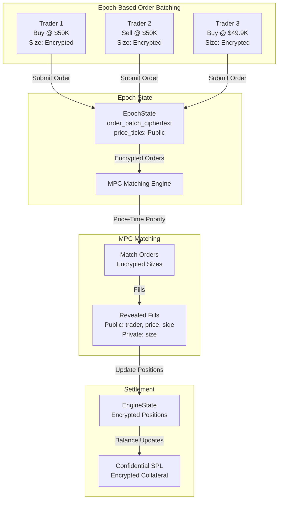

# Orderbook Matching Architecture: Encrypted Peer-to-Peer Trading

## Executive Summary

This document describes the **peer-to-peer orderbook matching system** implemented for privacy-preserving perpetual trading. This system enables encrypted order matching where traders match directly against each other, with order sizes kept private via Arcium MPC. Orders are batched per epoch and matched using price-time priority, with all matching logic executed in encrypted MPC circuits.

## Design Rationale

### Why Orderbook Matching?

**Peer-to-peer orderbook matching** offers several advantages:

1. **True Price Discovery**: Traders set their own prices, enabling market-driven price discovery
2. **Order Flexibility**: Support for limit orders, market orders, IOC, PostOnly
3. **Competitive Pricing**: Traders compete on price, leading to better execution
4. **No Pool Dependency**: Doesn't require liquidity pool capital
5. **Privacy-Preserving**: Order sizes encrypted, only prices and sides public

### The Challenge

Implementing orderbook matching with **encrypted order sizes** in MPC is complex:
- Matching logic must work on encrypted data
- Price-time priority requires sorting and conditional logic
- Partial fills need careful handling
- Risk checks must validate encrypted positions

## Architecture Overview

### Core Concept: Encrypted Order Matching



### Key Innovation: Privacy-Preserving Matching

- **Public**: Prices, sides, trader identities, submission times
- **Private**: Order sizes, position sizes, collateral amounts
- **MPC Matching**: Price-time priority matching on encrypted data
- **Epoch Batching**: Orders collected per epoch, matched at epoch boundary

## Architecture Components

### 1. Market State

```rust
pub struct MarketState {
    pub market_id: u16,
    pub base_asset_mint: Pubkey,
    pub quote_asset_mint: Pubkey,
    
    // Market configuration (public)
    pub tick_size: u64,
    pub min_order_size: u64,
    pub max_order_size: u64,
    pub maker_fee_bps: u16,
    pub taker_fee_bps: u16,
    
    // Encrypted engine state (Enc<Mxe, EngineState>)
    pub engine_state_ciphertext: Vec<u8>,
    pub engine_state_version: u64,
    
    // Public market data
    pub mark_price: u64,
    pub index_price: u64,
    pub funding_rate: i64,
    
    // Epoch management
    pub current_epoch_id: u64,
    pub epoch_start_slot: u64,
    pub epoch_duration_slots: u64,  // Default: 150 slots (~1.5s)
    
    pub status: MarketStatus,
}
```

### 2. Epoch State

```rust
pub struct EpochState {
    pub market_id: u16,
    pub epoch_id: u64,
    pub start_slot: u64,
    pub end_slot: u64,
    
    // Encrypted order batch (Enc<Mxe, OrderBatch>)
    pub order_batch_ciphertext: Vec<u8>,  // ~50KB max
    
    // Public price ticks observed in this epoch
    pub price_ticks: Vec<u64>,  // Sorted list of prices with orders
    
    // Settlement status
    pub is_settled: bool,
    pub settlement_slot: Option<u64>,
}
```

### 3. Order Submission Flow

1. **Trader submits order**: `submit_order(price, side, enc_size)`
2. **Order stored in epoch**: Added to `EpochState.order_batch_ciphertext`
3. **Price tick recorded**: Public price added to `price_ticks` (if not exists)
4. **Wait for epoch end**: Orders accumulate during epoch
5. **Epoch settlement**: `settle_epoch()` triggers MPC matching

### 4. MPC Matching Instruction

```rust
#[instruction]
pub fn match_batch(
    mxe: Mxe,
    order_sizes: [Enc<Shared, u64>; 100],  // Encrypted order sizes
    order_count: u16,
    public_prices: [u64; 100],             // Public prices
    price_count: u16,
    mark_price: u64,
) -> (Enc<Mxe, u128>, u16) {
    // Matching algorithm:
    // 1. Group orders by price (public)
    // 2. Sort by submission_slot (FIFO)
    // 3. Match asks vs bids iteratively
    // 4. Update encrypted positions/margins
    // 5. Return open interest and fill count
}
```

**Matching Algorithm** (Target Implementation):
- **Price-Time Priority**: Match at best price, FIFO within price level
- **Encrypted Sizes**: Match encrypted order sizes without revealing
- **Partial Fills**: Support partial order fills
- **Risk Checks**: Validate margin requirements during matching

## Implementation Status

### ✅ Completed

- **Account Structures**: `MarketState`, `TraderState`, `EpochState`, `FillEvent`
- **Order Submission**: `submit_order()` instruction with encrypted sizes
- **Epoch Management**: Epoch creation and settlement framework
- **MPC Matching Skeleton**: `match_batch()` instruction structure
- **Client SDK**: `order_matching_client.ts` with order submission utilities
- **Supporting MPC**: `apply_funding()`, `check_liquidation()`, `compute_risk()`, `update_collateral()`

### 🚧 Current Challenges

#### 1. **Matching Algorithm Implementation**

**Status**: Basic structure exists, full matching logic needs implementation

**Current State**: 
- `match_batch()` exists but currently only sums order sizes
- Matching algorithm (price-time priority) needs full implementation
- Partial fill handling not yet implemented
- Order cancellation during matching not handled

**Technical Constraints**:
- Arcis requires fixed-size arrays: `[Enc<Shared, u64>; 100]` limits capacity
- No dynamic loops - must use compile-time constant bounds
- Sorting encrypted data requires careful MPC design
- Conditional logic on encrypted values is complex

**Approach**:
- Use fixed-size arrays with `order_count` parameter
- Implement price grouping using public prices
- FIFO sorting within price levels using `submission_slot`
- Iterative matching with fixed loop bounds

#### 2. **Epoch Settlement Integration**

**Status**: Framework exists, MPC callback integration incomplete

**Current State**:
- `settle_epoch()` instruction exists
- MPC invocation not yet connected
- Callback handling for matching results needs implementation
- Fill event emission not implemented
- Position updates from matches not connected

**Required Work**:
- Connect `settle_epoch()` to Arcium computation invocation
- Implement callback handler for `match_batch` results
- Emit `FillEvent` accounts with public metadata
- Update encrypted positions via MPC
- Update Confidential SPL balances

#### 3. **Order Cancellation**

**Status**: Placeholder instructions exist, implementation needed

**Current State**:
- `cancel_order()` and `cancel_all_orders()` are placeholders
- No mechanism to remove orders from encrypted batch
- Orders remain in batch until epoch settlement

**Design Options**:
1. **MPC-based removal**: Use MPC to "filter out" cancelled orders
2. **Cancellation registry**: Maintain separate on-chain cancellation list
3. **Epoch-based cancellation**: Only allow cancellation before epoch starts

**Recommended**: Cancellation registry - simpler and more efficient

#### 4. **Risk Validation During Matching**

**Status**: Risk computation exists, integration into matching needed

**Current State**:
- `compute_risk()` MPC instruction exists
- Not integrated into matching flow
- Risk checks happen separately from matching

**Required Integration**:
- Validate margin before matching orders
- Check position limits during matching
- Reject orders that would violate risk constraints
- Update risk state atomically with position updates

#### 5. **Client-Side Encryption**

**Status**: Basic utilities exist, full integration needed

**Current State**:
- `encryptOrderSize()` function exists in client SDK
- Arcium client SDK integration partial
- Decryption utilities need completion

**Required Work**:
- Complete Arcium client SDK integration
- Key management and storage
- Encryption/decryption performance optimization
- Error handling and retry logic

## Design Considerations

### Epoch-Based Batching

**Why Epochs?**
- Privacy: Batch orders together to obscure individual timing
- Efficiency: Batch MPC operations reduce costs
- Fairness: All orders in epoch treated equally

**Trade-offs**:
- Latency: Orders wait until epoch end (~1.5 seconds)
- No immediate execution
- But: Better privacy and lower costs

### Price-Time Priority

**Why This Matching Rule?**
- Standard in traditional exchanges
- Fair and predictable
- Encourages competitive pricing

**Implementation Challenge**:
- Requires sorting on encrypted data (submission_slot)
- Complex conditional logic in MPC
- But: Achievable with careful design

### Encrypted Order Sizes

**Why Encrypt Sizes?**
- Prevents front-running
- Protects trader strategies
- Maintains privacy

**Trade-off**:
- More complex matching logic
- But: Essential for privacy-preserving trading

## Comparison with Alternative Approaches

### Orderbook vs Pool-Based Trading

| Aspect | Orderbook Matching | Pool-Based Trading |
|--------|-------------------|-------------------|
| **Execution Model** | Peer-to-peer | Peer-to-pool |
| **Liquidity** | Requires counterparty orders | Guaranteed from pool |
| **Price Discovery** | Market-driven (traders set prices) | Oracle-based ± spread |
| **Privacy** | ✅ Encrypted order sizes | ❌ Positions visible (traditional) |
| **Complexity** | High (matching logic) | Low (simple swaps) |
| **Order Types** | Limit, Market, IOC, PostOnly | Market only |
| **Capital Efficiency** | No pool capital required | Requires LP capital |

### Orderbook vs Mixer Pool

| Aspect | Orderbook Matching | Mixer Pool |
|--------|-------------------|------------|
| **Execution Model** | Peer-to-peer | Peer-to-pool |
| **Liquidity** | Requires counterparty orders | Guaranteed from pool |
| **Privacy** | ✅ Encrypted order sizes | ✅ Encrypted positions |
| **Complexity** | High (matching logic) | Medium (mixing logic) |
| **Price Discovery** | Market-driven | Oracle-based |
| **Order Types** | Limit, Market, IOC, PostOnly | Position-based |
| **Matching Logic** | Price-time priority | Aggregation only |

**Key Insight**: Both approaches have merit. Orderbook offers better price discovery and order flexibility. Mixer pool offers guaranteed liquidity and simpler implementation.

## Future Development Path

### Phase 1: Complete Core Matching

1. **Implement Price-Time Priority**
   - Group orders by price (public)
   - Sort by submission_slot within price level
   - Match iteratively with fixed loop bounds

2. **Partial Fill Handling**
   - Track remaining size per order
   - Continue matching until orders exhausted
   - Update order states atomically

3. **Risk Integration**
   - Validate margin before matching
   - Reject orders that violate constraints
   - Update risk state with positions

### Phase 2: Settlement Integration

1. **MPC Callback Implementation**
   - Connect `settle_epoch()` to Arcium
   - Handle matching results in callback
   - Update on-chain state atomically

2. **Fill Event Emission**
   - Create `FillEvent` accounts
   - Reveal public metadata only
   - Keep sizes private

3. **Position Updates**
   - Update encrypted positions via MPC
   - Update Confidential SPL balances
   - Maintain consistency

### Phase 3: Order Management

1. **Cancellation System**
   - Implement cancellation registry
   - Filter cancelled orders in MPC
   - Handle cancellation edge cases

2. **Order Modification**
   - Allow price/size updates
   - Handle modification during epoch
   - Maintain order integrity

### Phase 4: Advanced Features

1. **Stop-Loss / Take-Profit**
   - Conditional order execution
   - Trigger in MPC matching
   - Price-based triggers

2. **Aggregate Size Visibility**
   - Reveal aggregate size per price level
   - Improve price discovery
   - Maintain individual privacy

3. **Keeper Network Integration**
   - Off-chain keepers monitor orders
   - Execute limit orders when conditions met
   - GMX-style execution model

## Technical Challenges & Solutions

### Challenge 1: Sorting Encrypted Data

**Problem**: Need to sort orders by submission_slot for FIFO matching

**Solution**: Use public submission_slot, sort in MPC using conditional swaps

### Challenge 2: Fixed-Size Arrays

**Problem**: Arcis requires fixed-size arrays, limiting order capacity

**Solution**: Use `[Enc<Shared, u64>; 100]` with `order_count` parameter, process only active orders

### Challenge 3: Conditional Matching Logic

**Problem**: Need to match orders conditionally based on price and size

**Solution**: Use nested loops with compile-time bounds, conditional logic inside

### Challenge 4: Partial Fills

**Problem**: Orders may partially fill, need to track remaining size

**Solution**: Maintain fill state in encrypted order structure, update iteratively

## Related Documents

- **[MIXER_POOL_ARCHITECTURE.md](./MIXER_POOL_ARCHITECTURE.md)** - Alternative architecture approach
- **[ARCIUM_PRIVATE_PERPS_ARCHITECTURE.md](./ARCIUM_PRIVATE_PERPS_ARCHITECTURE.md)** - Original architecture specification
- **[ARCIUM_PRIVATE_PERPS_TECHNICAL_DESIGN.md](./ARCIUM_PRIVATE_PERPS_TECHNICAL_DESIGN.md)** - Technical implementation details

## Conclusion

The orderbook matching system represents a **sophisticated approach** to privacy-preserving peer-to-peer trading. While implementation challenges exist, particularly around MPC matching logic and Arcis constraints, the architecture provides:

- **True price discovery** through market-driven pricing
- **Order flexibility** with multiple order types
- **Privacy preservation** through encrypted order sizes
- **Fair matching** via price-time priority

The system is **actively being developed** and represents a viable path forward for privacy-preserving perpetual trading. The challenges are technical and solvable, not fundamental architectural flaws.

**Next Steps**: Continue implementation of matching algorithm, complete epoch settlement integration, and build out order management features.
